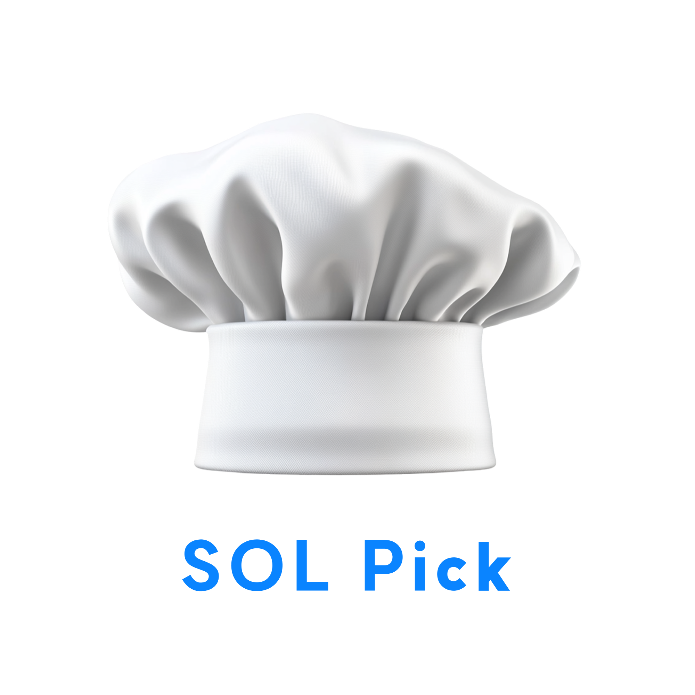

<div align="center">
  
  <br>

  # 🥦 SolPick - 맞춤형 식재료 관리 및 레시피 추천 서비스  
  **"당신의 냉장고를 더 스마트하게!"**  
  <br>

  ## 🛠 기술 스택
  
  
  
  
  
  <br>

  ## 📌 프로젝트 소개  
  **SolPick**은 사용자의 **냉장고 속 식재료를 관리**하고, **맞춤형 레시피를 추천**하는 서비스입니다.  
  또한 **게임화(Gamification)** 요소를 적용하여 포인트 적립 및 **SolPick 전용 카드 서비스**를 제공합니다.  
  <br>

  ## 🚀 주요 기능  

  ### 🛍️ 플랫폼 연동  
  **ReciPICK & SOL Pick 크로스 인증**  
  **주문 결제 및 포인트 연동**  

  ### 💳 SolPick 카드 서비스  
  **SolPick 신용카드 발급**  
  **커스터마이징 디자인 적용**  
  **사용 실적 기반 포인트 적립**  

  ### 🎮 포인트 적립형 미니게임  
  **고양이 밥 주기 🐱**  
  **식재료 탐색 🔍**  
  **카드 뒤집기 게임 🎴 (사료 획득)**  

  ### ❄️ 스마트 냉장고  
  **직관적인 냉장고 UI**  
  **OCR 기반 영수증 등록 📸**  
  **자동 유통기한 알림 ⏳**  

  ### 🍽️ 레시피 서비스  
  **알러지 정보 & 보유 식재료 기반 AI 레시피 추천**  
  **AI 기반 1주일 식단 자동 생성 📅**  
  **함께 요리하기 👩‍🍳👨‍🍳**  
  <br>

  ## 🔧 설치 및 실행  

  ### 💻 시스템 요구사항  
  **☑️ Node.js 16.0.0 이상**  
  **☑️ npm 7.0.0 이상**  

  ### 📥 설치  
  ```bash
  git clone https://github.com/SHDS-SOLPick/sol-pick-fe.git
  cd sol-pick-fe
  npm install
  ```

  ### 🚀 실행  
  ```bash
  npm start
  npm run build
  npm test
  ```

  ## 🌐 환경 변수 설정  
  ```plaintext
  REACT_APP_API_URL=백엔드 API URL
  REACT_APP_IMAGE_URL=이미지 서버 URL
  ```

  ## 👥 팀 정보  
  | 성명  | 역할 | 기능 | Github |
  |--------|------|-------------------|---------|
  | **김정란** | 팀장 / Frontend&Backend | 가드 서비스, 미니게임 | [GitHub](https://github.com/jrkim-kr) |
  | **고은지** | 팀원 / Frontend&Backend | API 통신 및 인증, 함께 요리 | [GitHub](https://github.com/eko147) |
  | **양진영** | 팀원 / Frontend&Backend | 레시피 및 식단 추천 | [GitHub](https://github.com/jinyoung1221) |
  | **임아영** | 팀원 / Frontend&Backend | React 공통 컴포넌트 개발, 냉장고 CRUD, 유통기한 알림 | [GitHub](https://github.com/ayeooong) |
  
</div>

